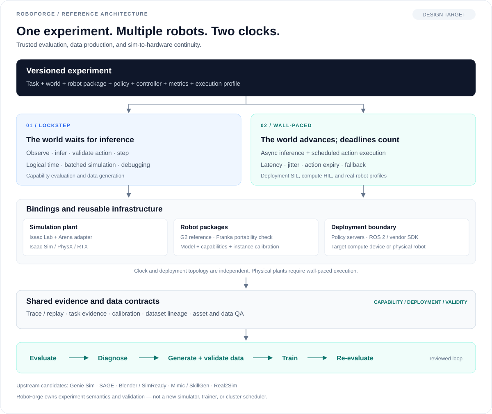

# RoboForge

**A multi-robot platform for evaluation, data production, and simulation-to-hardware experimentation.**

RoboForge is organized around versioned experiments. It builds on ecosystems such as Isaac Lab, Isaac Lab-Arena, and Genie Sim to connect tasks, robots, policies, controllers, and execution traces. The goal is to carry the same task from **stop-the-world lockstep simulation** to **SIL / HIL**, then use paired real-world calibration to determine whether the evaluation and generated data are actually useful.

> **Status: design and research phase.** This repository does not yet contain a runnable platform, installable package, or validated robot integration. The documents below describe the intended architecture and contracts.

## Design principles

- **Multi-robot, not G2-only.** AgiBot G2 is the first full reference implementation. New embodiments are added through `RobotPackage`; a simulated Franka is the first portability check.
- **Two timing semantics.** `lockstep` advances logical time only after the policy responds. `wall_paced` follows real timing and makes latency, jitter, stale actions, and deadline misses explicit. SIL/HIL describe deployment topology, not a third clock.
- **One contract for evaluation and data.** Tasks, action semantics, and traces are shared across workflows. Capability, deployment behavior, and sim-real validity are reported separately, enabling an evaluation → failure analysis → targeted data → training → re-evaluation loop.

## What we reuse vs. what RoboForge owns

| Reuse | RoboForge owns |
| --- | --- |
| Isaac Lab / Isaac Sim: environments, physics, sensors | Experiment contracts, robot packages, execution semantics |
| Arena: task composition and evaluation components | Domain tasks, scoring evidence, regression protocols |
| Genie Sim: G2 assets, control, and data-collection references | Adaptation, calibration, validation, provenance |
| Mimic / SkillGen and upstream world generators | Data QA, split governance, training-value validation |
| Policy servers, ROS 2 / SDKs, OSMO and related infrastructure | Policy adapters, timing traces, workflow boundaries |

RoboForge is not intended to reimplement a simulator, training framework, or cluster scheduler, and it does not treat a visually convincing scene as a training-ready environment.

## First milestone

Run the same versioned task on G2 simulation in lockstep evaluation, deployment-timing SIL, and target-compute HIL, with evaluation traces that can be rescored offline. Then add a second robot package to prove portability. Data production uses the same task and trace contracts.

## Documentation

| Document | Scope |
| --- | --- |
| [Architecture & scope](docs/architecture.md) | Layers, interfaces, ownership, non-goals |
| [Execution model](docs/execution-model.md) | Stop-the-world, SIL/HIL, action timing, failure handling |
| [Robot packages](docs/robot-packages.md) | G2 reference integration, portability, calibration |
| [Evaluation & data](docs/evaluation-and-data.md) | Scoring, sim-real validity, traces, data production and QA |
| [Technical decisions](docs/technical-decisions.md) | Defaults, alternatives, re-evaluation triggers |
| [Roadmap](docs/roadmap.md) | Milestones, exit criteria, open validation work |
| [Research notes](docs/research/README.md) | Consolidated findings, project landscape, sources |

## License

[MIT](LICENSE). Third-party code, robot assets, models, datasets, and SDKs remain subject to their own licenses; the repository's MIT License does not relicense those materials.
